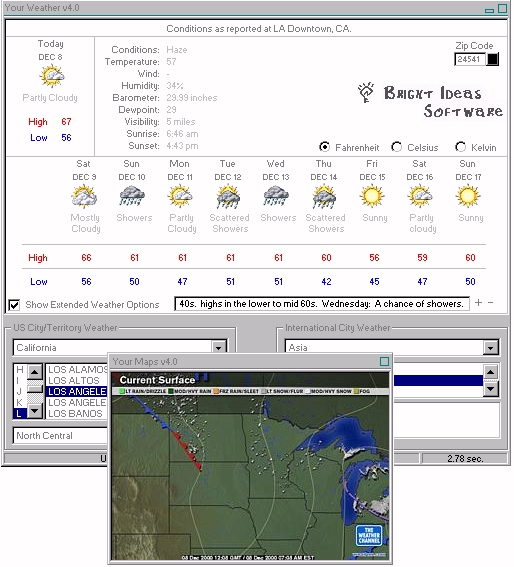



## Your Weather v4\.0 \*Get Local And International Weather\*

### Description

This is by far the best weather program out there.. Sounds conceited I know. Take a look at the features and you will see what I mean. This isn't one of those enter a zip code and get a few minor details about your weather, type programs - this gives you everything. This gives you a 10 day forecast, graphics to indicate conditions, current conditions, international city weather, US City weather, local US detailed forecast scroller, and weather radar maps for almost all regions of the world. I spent a long time on this. Apparently this program was good enough to spark a few comments from Weather.com telling me that they didn't like me distributing this as it could potentially dramatically decrease the ammount of traffic that passes through their site. It takes on average 10 seconds to retrieve weather information through my program and can take up to 5 minutes just to find what you want on their site. This cuts out the middle man and gives you what you want. Just make sure you're connected to the internet and you're all set. Best of all it's FREE.
 
### More Info
 

             |
---                |---
**Submitted On**   |2001-01-09 20:28:26
**By**             |[Nathan](https://github.com/Planet-Source-Code/PSCIndex/blob/master/ByAuthor/nathan.md)
**Level**          |Advanced
**User Rating**    |4.5 (276 globes from 62 users)
**Compatibility**  |VB 5\.0, VB 6\.0
**Category**       |[Internet/ HTML](https://github.com/Planet-Source-Code/PSCIndex/blob/master/ByCategory/internet-html__1-34.md)
**World**          |[Visual Basic](https://github.com/Planet-Source-Code/PSCIndex/blob/master/ByWorld/visual-basic.md)
**Archive File**   |[CODE\_UPLOAD136811112001\.zip](https://github.com/Planet-Source-Code/nathan-your-weather-v4-0-get-local-and-international-weather__1-13424/archive/master.zip)

